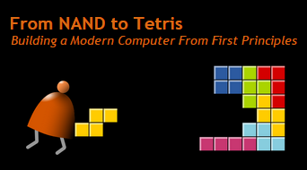

# Nand to Tetris 
Welcome to the Nand to Tetris course repository! Here you'll find a series of courses designed to take you on an exciting journey from understanding the fundamental building blocks of computer systems to constructing your own general-purpose computer capable of running programs like Tetris.

### Introduction
In today's world, computers are ubiquitous, yet many of us lack a deep understanding of how they actually work. At Nand to Tetris, I believe that the best way to truly understand computers is to build one from scratch. This course offer a hands-on approach to learning, guiding anyone through the intricate web of hardware, software, and application systems.

** Nand2Tetris covers the following key areas:  **

> *Hardware:* From Boolean arithmetic to chip simulation and testing.   
> *Architecture:* Including ALU/CPU design, addressing modes, and memory-mapped I/O.  
> *Low-level Languages:* Design and implementation of machine language and assembly programming.  
> *Virtual Machines:* Stack-based automata, function call handling, and VM language design.  
> *High-level Languages:* Object-based language design and implementation.  
> *Compilers:* Lexical analysis, parsing, code generation, and two-tier compilation.  
> *Programming:* Implementation of assemblers, virtual machines, and compilers.  
> *Operating Systems:* Design and implementation of memory management, input/output drivers, and more.  
> *Data Structures and Algorithms:* Covering a range of fundamental data structures and algorithms.  
> *Software Engineering:* Modular design, API design, unit testing, and quality assurance.  
(----)

This repository provides supplemental resources, including completed solutions for the exercises and all weekly assignments, alongside the final project code.

*__Let's dive into the world of computer science and engineering, one logic gate at a time!__*

Note: Portions of this README are adapted from the Nand to Tetris course materials for clarity and conciseness.
